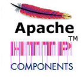
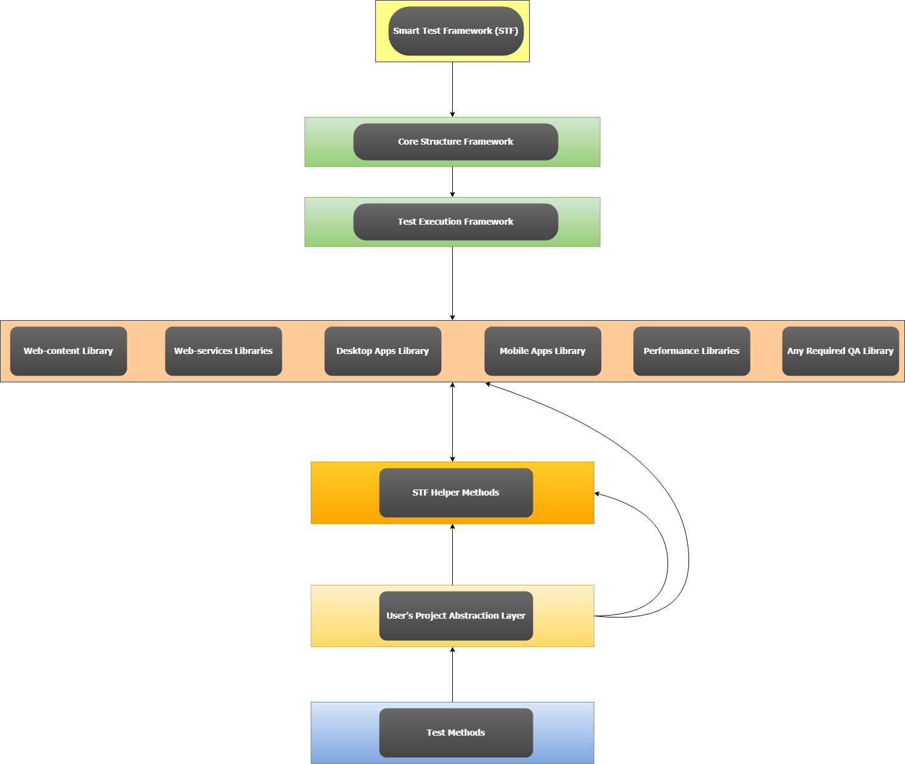
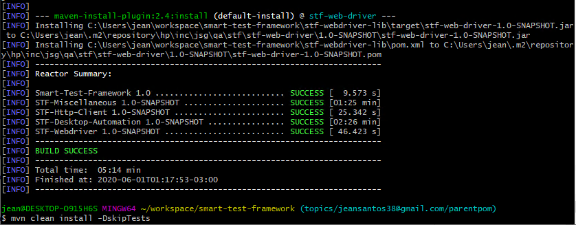

# Smart-Test-Framework 
 
### What is that?
Smart Test Framework is multi-purpose test framework composed by four independent libraries. You’ll be able to create automated tests for Web pages (via desktop and mobile web browsers), Web services (REST APis), Desktop applications (on Windows, Mac and Linux) and Mobile applications (native and hybrid). It's flexible enough to support most of projects and to provide professional quality to automated test needs.
 
### What can be tested with Smart Test Framework?
- Web pages (via desktop and mobile web browsers)
- Web services (REST APis)
- Desktop applications (on Windows, Mac and Linux)
- Mobile applications (native and hybrid)
 
### What was the motivation to create Smart Test Framework
As a QA Test Engineer I saw over and over the following scenarios regarding projects that needed automated tests.
	- Teams developing from scratch quite similar frameworks (good ones), but totally tied to their respective projects reality - so it cannot be re-used in new projects.
	- Projects that have chosen multiple QA tools\frameworks to test End-to-End solutions, having a hard time having to deal with trainings for each tool, context switching all the time and the difficulty to integrate different test results formats

So my thought was, why not developing a multi-purpose test framework generic enough that would on most of HP Inc projects? So anyone that want to use it,  would just need to develop their project specific abstractions on top of STF.

If HP aims to share solutions among teams to prevent re-work, why not doing the same with QA frameworks?

And anyone could be a collaborator, for instance, someone had to develop a new feature that could be useful to other teams, so let's add it in STF and make it available to all its community.

### Where it can be used and for what type of tests?
- Regression testing
- Integration testing
- System testing
- End-to-End testing
- etc.
 
### Advantages of Smart Test Framework
- It provides you a common syntax to write any supported type of test - 
- You've to train Testers and developers just once - 
- Supports detailed reports for test executions -  
 
### Why using STF instead other frameworks?
Using Smart Test Framework allows you to expedite you environment setup and deliver tests due to some of its features:
- A single programming language **there's no context switch, adds efficiency**
- A common syntax to write your tests **speeds up test creation**
- A common detailed test execution report **speeds up test results triage and reports**
- A single training to testers and developers understand how to use it **speeds up environment setup  and usage** 
  
When using **Other frameworks** that are usually **designed for a single test purpose**, then you need to consider all these:
- Change context between different tools APIs\IDEs when testing end-to-end testing
- Change context between different programming languages when testing end-to-end testing
- Effort to integrate different test results from different tools in a common report
- Spent more time and money on training testers and developers to use multiple different QA tools

***
 
## Details about Smart Test Framework architecture
Sure, so let's start from one mandatory aspect of it:  **There's no room in STF for reinventing the wheel**

To be compliance with that mandatory aspect, STF has consolidated the very best available frameworks that can be used for QA purpose and added a minimum of abstraction. So it's possible to provide flexibility and efficiency to STF users - something that won't be found other frameworks.

The abstraction layers of STF are optional, so you can stick with all supported frameworks native APIs - and just use STF APIs when is useful.

**These are the well-known and 'rock-solid' existent frameworks that are part of STF core library.**

- Selenium
- Appium
- SikuliX
- TestNG
- Allure

### Selenium  

I've chosen Selenium to make WebUi tests flexible. A test that you've created to run in desktop browsers will work on mobile browsers too. It also works great with STF data-driven feature.

Some notes from its official site:

`"Selenium automates browsers. That's it! What you do with that power is entirely up to you. Primarily, it is for automating web applications for testing purposes, but is certainly not limited to just that. Boring web-based administration tasks can (and should!) be automated as well."`

### Appium  

I've chosen Appium to make Mobile Application tests flexible. It's compatible with most STF Selenium helpers. It also supports STF data-driven feature for mobile testing.

Some notes from its official site:

`"Appium is an open source test automation framework for use with native, hybrid and mobile web apps. It drives iOS, Android, and Windows apps using the WebDriver protocol."`

Check [http://appium.io/](http://appium.io/)


### SikuliX  

I've chosen SikuliX because it's a powerful framework that allows you to test anything visible in the screen. It can reach visual components that even where Selenium and Appium cannot. It supports STF image data-driven allowing you to easily create reliable tests for desktop apps using a minimum of master images! This is one of the key features of STF.

Some notes from its official site:

`"SikuliX automates anything you see on the screen of your desktop computer running Windows, Mac or some Linux/Unix. It uses image recognition powered by OpenCV to identify and control GUI components. This is handy in cases when there is no easy access to a GUI's internals or the source code of the application or web page you want to act on."`

Check [http://appium.io/](http://appium.io/)

### Apache Http Client  

This is a solid, flexible and reliable HTTP Client. Using STF abstraction layer for it will allow you to speed up the development of automated tests for you rest APIs easier than you can image!

Some notes from its official site:

`"The Hyper-Text Transfer Protocol (HTTP) is perhaps the most significant protocol used on the Internet today. Web services, network-enabled appliances and the growth of network computing continue to expand the role of the HTTP protocol beyond user-driven web browsers, while increasing the number of applications that require HTTP support.  
...  
  Designed for extension while providing robust support for the base HTTP protocol, HttpClient may be of interest to anyone building HTTP-aware client applications such as web browsers, web service clients, or systems that leverage or extend the HTTP protocol for distributed communication."`

Check [https://hc.apache.org/httpcomponents-client-ga/](https://hc.apache.org/httpcomponents-client-ga/)
 
 
 ### testNG  
 
 testNG is like Junit, but with steroids. Jokes aside, testNG is by far one of the most complete and powerful test execution frameworks I've ever saw during my QA career - I can tell you this for sure. This is the nervous system from STF, allowing to run test sets on any order, dependency, single or multi-thread. Then connecting all this with a report test results framework. This framework is pure gold!
 
 Some notes from its official site:
 
 `"TestNG is a testing framework inspired from JUnit and NUnit but introducing some new functionalities that make it more powerful and easier to use, such as:`
   	
   	• Annotations.
   	• Run your tests in arbitrarily big thread pools (all methods in their own thread, one thread per test class, etc...).
   	• Test that your code is multithread safe.
   	• Flexible test configuration.
   	• Support for data-driven testing (with @DataProvider).
   	• Support for parameters.
   	• Powerful execution model (no more TestSuite).
   	• Supported by a variety of tools and plug-ins (Eclipse, IDEA, Maven, etc...).
   	• Embeds BeanShell for further flexibility.
   	• Default JDK functions for runtime and logging (no dependencies).
   	• Dependent methods for application server testing.
   
   `"TestNG is designed to cover all categories of tests:  unit, functional, end-to-end, integration, etc..."`
 
 Check [https://testng.org/doc/](https://testng.org/doc/)


### Allure  

Even testNG framework has its own test execution reports, it's too simple for professional usage in my opinion. Especially when it comes to check historical results, trends etc. So, therefore STF makes usage of Allure. This is by far one of the most complete and powerful test results reports available. Even it does support multiple execution frameworks, just a few can make use of most important features of Allure and testNG is one of them. Using Allure with testNG is a win-win.

Some notes from its official site:

`"Allure Framework is a flexible lightweight multi-language test report tool that not only shows a very concise representation of what have been tested in a neat web report form, but allows everyone participating in the development process to extract maximum of useful information from everyday execution of tests."`

Check [https://docs.qameta.io/allure/](https://docs.qameta.io/allure/)

### What's the programming language used?
Java. Simple as that. But before any eye-rolling, let's clarify what are the reasons for using Java.

This is not about personal preferences. This is all about aiming for reliability and quality when doing professional testing, so let's consider these facts

- The testNG is java based. **There are no similar substitutes considering its features.** It integrates perfectly with Allure results.
- SikuliX is java based. **There are no similar substitutes.**
- Apache HTTP Client, Selenium, Appium, testNG, Allure and SikuliX communities (java) are active and for sure you'll be able to find any examples\snippets you might need.

These two items above made me decide using Java.
 So if you're worried about the usage of the Java language itself, take note that
- The objective of STF APIs is to provide maximum abstraction, you don't need to worry about coding too much java, most of tests just requires calling STF API methods.
- Java is a reliable language, especially if you'll need to create a test infrastructure to support thousands of tests.
- Strongly typed language makes easier to understand and identify what objects should be used. I can tell for sure that using weak type languages for complex projects can become a test worst nightmare.
- When you have a considerable amount of test code related to your project, you'll want to know if any changes has impacted\broken your code as soon as possible and not just in run-time when it could be too late...

Last but not least. I've seen teams multiple times teams **replacing their QA frameworks**, having a lot of re-work to migrate all tests into a new tool, due to:
- Lack of flexibility. The project requires QA to a new feature that it's not support by current framework.
- Lack of reliability. You simply cannot rely on test results, every time you run the test suite you'll have different results.
- Too Complex to use. Difficulty to setup, create helpers and triage failures, requires a lot of training and usually a previous tests, requiring too much previous knowledge from testers and developers.
 
**Using STF, a java solution, you won't have these type of drawbacks.**

### High level components structure


 ## STF Core Helpers
These are the main helpers (wrappers) that STF does provide to make easier creating tests. 
- HttpClient *(Apache Http Client)*  
- WebDriverSeleniumHelper *(Selenium)*
- WebDriverAppiumHelper *(Appium)*
- WebDriverHelperDataDrivenHelper *(Selenium and Appium)*
- DesktopAutomationHelper *(SikuliX)*
- DesktopAutomationDataDrivenHelper *(SikuliX)*
- STF MultiPurposeHelpers *(Regex,InputOutput, Calendar, Serializer/Deserializer, Data Generation, etc.,)*

***

## STF Core Helpers Usage
Detailed instructions on how to use STF APIs.

### HttpClient
#### First steps:
This helper `HttpClient.java` can be found in this namespace: `hp.inc.jsg.qa.stf.framework.httpclient`

This is how to instantiate it:
```java
public void initialize() throws Exception {
        ProxySettings proxySettings = new ProxySettings(true);
        HttpClient httpClient = new HttpClient(new TestLog(), proxySettings);
    }
```

#### Main feature:
- httpClient.performHttpRequest(...)

The advantage of using this one is the possibility of using `HttpDetailedRequest.java` and `HttpDetailedResponse.java`.

#### Example:
```java
    public void stfHttpClientRequest() throws Exception {
        HttpDetailedRequest httpDetailedRequest = new HttpDetailedRequest();

        //Mandatory ones
        httpDetailedRequest.url = "http://localhost:8089" + endpoint;
        httpDetailedRequest.method = HttpRequestMethod.PUT;

        //Optional ones
        httpDetailedRequest.headers = httpDetailedHeaders;
        httpDetailedRequest.payloadToBeSent = requestBody.getBytes();
        httpDetailedRequest.logLevel = HttpRequestLogLevel.LOG_EVERYTHING_FROM_REQUEST;
        httpDetailedRequest.statusCodeVerifier = statusCodeVerifierFor2XX;

        HttpDetailedResponse httpResponse;
        httpResponse = httpClient.performHttpRequest(httpDetailedRequest);
        //or
        httpResponse = httpClient.performHttpRequest(HttpRequestMethod.PUT, "http://localhost:8089" + endpoint, httpDetailedHeaders, requestBody.getBytes());

        Assert.assertEquals(httpResponse.statusCode, 200);
        Assert.assertEquals(httpResponse.responseBody, responseBody);
        Assert.assertTrue(httpResponse.elapsedTime.elapsed(TimeUnit.MILLISECONDS) <= 600);
```

#### Important settings:

**In case you've sensitive data that should not be logged**
- Configure this property here on `httpDetailedRequest.logLevel`
     - LOG_NOTHING,
     - LOG_EVERYTHING_FROM_REQUEST_AND_RESPONSE,
     - LOG_BASIC_INFO_ONLY_FROM_REQUEST_AND_RESPONSE,
     - LOG_EVERYTHING_FROM_REQUEST_AND_RESPONSE_BUT_HEADERS,
     - LOG_EVERYTHING_FROM_REQUEST_AND_RESPONSE_BUT_PAYLOAD

**In case you've want to assure a request is working right away**
 - Configure this property here on `httpDetailedRequest.statusCodeVerifier`
      - EXPECTED_STATUS_CODE, `int`
      - LIST_OF_POSSIBLE_STATUS_CODES `int[]`
      - REGEX_FOR_POSSIBLE_STATUS_CODES `A regex to match status codes you want`

***

### WebDriverSeleniumHelper & WebDriverAppiumHelper
#### First steps:
The helpers `WebDriverSeleniumHelper.java` and `WebDriverAppiumHelper.java` can be found in this namespace: `hp.inc.jsg.qa.stf.framework.webdriver`

This is how to instantiate **WebDriverSeleniumHelper**:
```java
public void initialize() throws Exception {
        //mandatory
        WebDriverSeleniumHelper webDriverSeleniumHelper = new WebDriverSeleniumHelper(30, testLog);
        webDriverSeleniumHelper.setSeleniumDriver(chromeDriver);

        //optional
        webDriverSeleniumHelper.setEnableHighlightWebElementsOnFirst(true);
        webDriverAppiumHelper.setWebDriverWaitTimeoutSeconds(15);
    }
```

This is how to instantiate **WebDriverAppiumHelper**:
```java
public void initialize() throws Exception {
        //mandatory
        WebDriverAppiumHelper webDriverAppiumHelper = new WebDriverAppiumHelper(Platform.ANDROID,30, testLog);
        webDriverAppiumHelper.setAppiumDriver(androidDriver);

        //optional
        webDriverAppiumHelper.setEnableHighlightWebElementsOnFirst(true);
        webDriverAppiumHelper.setWebDriverWaitTimeoutSeconds(15);
    }
```

**Some other important configurations available:**
- webDriverSeleniumHelper.setWebDriverWaitTimeoutSeconds(...);

#### Main features:
 Most of these features should work for both selenium and appium, since both share a common helpers class.
 **webdriver abstractions**
   - webDriverSeleniumHelper.navigate(...);
   - webDriverSeleniumHelper.first(...); // Behaves as .findElement
   - webDriverSeleniumHelper.query(...); // Behave as .findElements
   - webDriverSeleniumHelper.waitForElementBecomeVisible(...);
   - webDriverSeleniumHelper.getSeleniumDriver(...);
   - webDriverSeleniumHelper.waitForElementExists(...);
   - webDriverSeleniumHelper.saveScreenshot(...);
   - webDriverSeleniumHelper.switchToWebFrame(...);
   - webDriverSeleniumHelper.switchTabs(...);
   - webDriverSeleniumHelper.endSeleniumWebdriverUsage(...);
   - webDriverAppiumHelper.tap(...);
   - webDriverAppiumHelper.sendKeysToiOS(...);
   - webDriverAppiumHelper.sendKeysToAndroid(...);

**Action abstractions**
   - webDriverSeleniumHelper.actionClick(...);
   - webDriverSeleniumHelper.actionDoubleClick(...);
   - webDriverSeleniumHelper.actionDragAndDropBy(...);
   - webDriverSeleniumHelper.actionSendKeys(...);

***

### DesktopAutomationHelper
#### First steps:
This helper `DesktopAutomationHelper.java` can be found in this namespace: `hp.inc.jsg.qa.stf.framework.desktop`

This is how to instantiate **DesktopAutomationHelper**:
```java
public void initialize() throws Exception {

       DesktopAutomationHelper desktopAutomationHelper = new DesktopAutomationHelper(
                testLog,
                screen, // Sikuli main class
                System.getProperty("user.home") + "/anyPlaceYouWantToSaveScreenshots", // String folderPathToSaveScreenshots
                0.96, //double sureMatchMinimumScore
                100, //double delayAfterSingleClickInMs
                20, //double delayBetweenMultipleClicksInMs
                true, //boolean takeFullScreenshotIfPatternNotFound
                true, //boolean takeRegionScreenshotIfPatternNotFound
                true); //boolean takeScreenshotIfOCRNotFound
    }
```

#### Main features:
 Most of the helpers below uses a Pattern (class from SikuliX api), that's an instance containing details from an image.
 It's possible to declare it in a Navigator file (instructions below), then just loading it into any helper you need.

 When you see *hover* it means that you'll have an indirect interaction, the STF will find an image, then interact with a relative coordinate to it, but outside the image itself. 

 **SikuliX abstractions**
   - desktopAutomationHelper.retrievePatternFromNavigator(...);
   - desktopAutomationHelper.click(...);
   - desktopAutomationHelper.rightClick(...);
   - desktopAutomationHelper.doubleClick(...);
   - desktopAutomationHelper.hoverClick(...);
   - desktopAutomationHelper.hoverTripleClick(...);
   - desktopAutomationHelper.hoverDoubleClick(...);
   - desktopAutomationHelper.mouseOver(...);
   - desktopAutomationHelper.saveDesktopScreenshot(...);
   - desktopAutomationHelper.waitPatternExists(...);
   - desktopAutomationHelper.exists(...);

#### Navigator Structure:
Navigator is a key part for using desktop automation. Instead having more lines of coding describing properties of each pattern (master image),
it's quite easier to have it declared in a .json file, then using proper helper to extract its values and returning a SikuliX object ready for use.
This is the file that contains information of all elements from a desktop app. It works like a map, telling to STF where to find it,
how to handle it. **This file must be in the folder location of the data driven and master images files.**

```json
{
  "MasterImageDetails": [
    {
      "areaId": "mainScreen",
      "elements": [
        {
          "element": {
            "selector": "txtBox_1",
            "ctrlType": "textBox",
            "interactionType": "indirect",
            "xCoordinate": 25,
            "yCoordinate": 58,
            "similarity": 0.7,
            "masterLoc": "mst_winformSTFdemo_v1-0_1920x1080_Win-10_ico_innerForm.png",
            "shortcuts": []
          }
        }
      ]
    }
  ]
}
```
#### Navigator Properties
| Item | Details |
| ------ | ------ |
| areaId | An area from the application you're testing, This id must be unique. |
| elements | Array of elements |
| element | It could be anything you want to interact from an App. |
| selector | This is the locator id of an element. Name it as you want. |
| ctrlType | Tells STF how to interact with the element. |
| interactionType | Tells to the STF if should interact with an image or an coordinate. |
| xCoordinate | X coordinate relative to a master image. |
| yCoordinate | Y coordinate relative to a master image. |
| similarity | The minimum % of matching criteria |
| masterLoc | The filename of the master image. |
| shortcuts | Keyboard shortcuts to access such element - if any. |

#### Navigator Properties - Special Settings
These are the possible values to these properties:

**ctrlType** 
- checkBox
- radioButton
- dropDownList
- button
- textBox
- trackBar
- pictureRegion
    - Use this one when declaring a master image.

**interactionType**
- direct
    - When the element is actually an image that you interact with.
- indirect
    - When the element could be anything, you're just clicking in a x,y coordinate outside an matching image.

***
## STF DataDriven
This is a so important feature of STF, that it deserves an entire section.

### WebDriverDataDrivenHelper
To be used for settings or asserting values for Selenium and Appium.

#### First steps:
This helper `WebDriverDataDrivenHelper.java` can be found in this namespace: `hp.inc.jsg.qa.stf.framework.datadriven`. It works for both *WebDriverAppiumHelper* and *WebDriverSeleniumHelper*

This is how to instantiate and use it:
```java
public void initialize() throws Exception {
        //instantiate
        WebDriverDataDrivenHelper webDriverDataDrivenHelper = new WebDriverDataDrivenHelper(testLog);

        //usage for selenium
        webDriverDataDrivenHelper.executeDataDriven(webDriverSeleniumHelper, "support-files/webUiDatadriven/dataDriven_webcontent.json", "set_validValues1");

        //usage for appium
        webDriverDataDrivenHelper.executeDataDriven(webDriverAppiumHelper, "support-files/MobileAppDatadriven/dataDriven_myHybridApp.json", "assert_validValues2");
    }
```

#### Set-Values DataDriven structure for webdriver usage:
```json
{
  "SmartDataDriven": [
    {
      "instructionSet": "set_validValues1",
      "statements": [
        {
          "statement": {
            "agent": "selenium",
            "purpose": "set",
            "selector": "input[name='tbx1']",
            "locator": "byCss",
            "action": "setField",
            "contentType": "string",
            "content": [
              "1 hello this is a test from STF"
            ]
          }
        }
      ]
    }
  ]
}
```

#### Set-Values Data Driven Properties details

These properties are common to both **SET** and **ASSERT** instructions set.

| Item | Details |
| ------ | ------ |
| instructionSet | A set of instructions to be executed in sequence |
| statements | Array statements |
| statement | Statement is an instruction |
| agent | STF structure is generic to be reusable, so we need to specify what agent should be used. |
| purpose | Are you about to set or assert values? |
| selector | The element selector so Selenium will be able to find it in the page. |
| locator | The locator strategy to find the element. |
| action | What method should be used with this statement. |
| contentType | The respective class type of the content you're providing. |
| content | Any value to be set or assert. |

#### Set-Values Data Driven Properties - Special Settings

These are the possible values to these properties:

**agent**
 - selenium
 - appium

**purpose**
-  set
-  assert

**locator**
- byId
- byXpath
- byClass
- byCss
- byName
- byTagName
- byLink
- byPartialLink

**action**
- setField
- assertField

**contentType**
- boolean
- integer
- string
- etc.

#### Assert-Values DataDriven structure for webdriver usage:
```json
{
  "SmartDataDriven": [
    {
      "instructionSet": "assert_validValues1",
      "statements": [
        {
          "statement": {
            "agent": "selenium",
            "purpose": "assert",
            "selector": "input[name='tbx1']",
            "locator": "byCss",
            "action": "assertField",
            "operator": "EqualTo",
            "contentType": "string",
            "content": [
              "1 hello this is a test from STF"
            ]
          }
        }
      ]
    }
  ]
}
```

#### Assert-Values Data Driven Properties details
For more details see `Set-Values Data Driven Properties details` above.

| Item | Details |
| ------ | ------ |
| operator | What type of assertion should be done |

#### Assert-Values Data Driven Properties - Special Settings

These are the possible values to these properties:

**operator**
 - EqualTo 
 - NotEqualTo
 - Contains
 - NotContain
 - GreaterThan
 - GreaterThanOrEqualTo
 - LesserThan
 - LesserThanOrEqualTo
 - Exists
 - NotExist

***

### DesktopAutomationDataDrivenHelper
To be used for settings or asserting values for SikuliX.

#### First steps:
This helper `DesktopAutomationDataDrivenHelper.java` can be found in this namespace: `hp.inc.jsg.qa.stf.framework.datadriven`. It works for both *WebDriverAppiumHelper* and *WebDriverSeleniumHelper*

This is how to instantiate and use it:
```java
public void initialize() throws Exception {
       //instantiate
              DesktopAutomationDataDrivenHelper dataDrivenHelper = new DesktopAutomationDataDrivenHelper(testLog);

       //usage
       dataDrivenHelper.executeDataDriven(
       desktopAutomationHelper,
       "/nav_winformSTFdemo_v1-0_1920x1080_Win-10_ALL-BTNS-AND-FUNCTIONS.json", //navigatorFile
       "/dd_winformSTFdemo_v1-0_SETS_AND_ASSERTS.json", //dataDrivenFile,
       "set_validValues_kickoffDemo" //instruction set);
```

#### Set-Values DataDriven Structure:
This files contains instructions to be set - must be in the same folder that contains Navigator file.
**This file should be in the same folder of Navigator and master images files.**
```json
{
  "SmartDataDriven": [
    {
      "instructionSet": "set_validValues1",
      "statements": [
        {
          "statement": {
            "agent": "sikuli",
            "purpose": "set",
            "selector": "txtBox_2",
            "areaId": "mainScreen",
            "action": "setField",
            "method": "byPaste",
            "contentType": "string",
            "content": [
              "this is a test"
            ]
          }
        }
      ]
    }
  ]
}
```

#### Set-Values Data Driven Properties details
These properties are common to both **SET** and **ASSERT** instructions set.

| Item | Details |
| ------ | ------ |
| instructionSet | A set of instructions to be executed in sequence |
| statements | Array statements |
| statement | Statement is an instruction |
| agent | STF structure is generic to be reusable, so we need to specify what agent should be used. |
| purpose | Are you about to set or assert values? |
| selector | The id from an Element in a Navigator file. |
| areaId | The id of from an AreaId in a Navigator file. |
| action | What method should be used with this statement. |
| method | Tells to STF how to interact with the element. |
| contentType | The respective class type of the content you're providing. |
| content | Any value to be set or assert. |

#### Set-Values Data Driven Properties - Special Settings

These are the possible values to these properties:

**agent**
 - sikuli

**purpose**
-  set

**action**
- setField

**method**
- byPaste
    - As you can imagine it will past values in a text box area.
- byKeystrokeSequence
    - You can send input values by simulating a sequence of key strokes.
- clickSequence
    - You can specify a number of elements (selector) in `content` property, to be clicked in sequence.
- byPointClick
    - Will click on the defined coordinate.
- byEvaluatePointClick
    - Depending the number of checkboxes or radio buttons available you can have false positives, so this action is the only way to make sure you're interacting with the correct one.;

**contentType**
- boolean
- integer
- string

#### Assert-Values DataDriven Structure:
This files contains instructions to be assert - must be in the same folder that contains Navigator file.
**This file should be in the same folder of Navigator and master images files.**
```json
{
  "SmartDataDriven": [
    {
      "instructionSet": "assert_validValues1",
      "statements": [
        {
          "statement": {
            "agent": "sikuli",
            "purpose": "assert",
            "selector": "txtBox_2",
            "areaId": "mainScreen",
            "action": "assertField",
            "method": "byOCR",
            "operator": "EqualTo",
            "contentType": "string",
            "content": [
              "this is a test"
            ]
          }
        }
      ]
    }
  ]
}
```

#### Assert-Values Data Driven Properties details
For more details, see Set-Values Data Drive above.
| Item | Details |
| ------ | ------ |
| action | What method should be used with this statement. |
| method | Tells to STF how to interact with the element. |
| contentType | The respective class type of the content you're providing. |
| content | Any value to be set or assert. |
| operator | What type of assertion should be done |

#### Assert-Values Data Driven Properties - Special Settings

These are the possible values to these properties:

**agent**
 - sikuli

**purpose**
-  assert

**action**
- assertField

**method**
-  byOCR
-  byImageFind
-  byImageFindInRegion

**operator**
- EqualTo
    - Use this one just for OCR
- Contains
    - Use this one just for OCR
- NotContain
    - Use this one just for OCR
- Exists
    - Use this one only for checking the existence of an Image (pattern)
- NotExists
    - Use this one only for checking the lack of an Image (pattern)

**contentType**
- picture
- boolean
- integer
- string

***

## How to setup Smart Test Framework

If you just want to start creating automated tests for your project right away, be sure to attend all these requirements first:
###Requirements
- Java8 installed
- Git installed and configured
- Any Java IDE ([IntelliJ Idea community](https://www.jetbrains.com/idea/download/#section=windows) *(free-version)* works great with STF)
- If you don't use IntelliJ, you'll need Maven binaries and all its mandatory environment variables configured
- If you're planning to create automated tests for desktop applications, then make sure you have SikuliX configure complete as described [here](https://raiman.github.io/SikuliX1/downloads.html).
- [Maven](https://maven.apache.org/download.cgi?Preferred=ftp://ftp.osuosl.org/pub/apache/) configured.

###Installing STF libs in local maven repository (.m2)
  Until smart-test-framework (stf) libs are not available in any Maven Central Repositories, **you must clone the source repository** and install its libs.
  *Please keep calm*, you can achieve this running just three command lines:
 ```shell
clone <stf repo>
cd <your stf cloned repo>
mvn clean install -DskipTests
```
As result you should see some output like this one:

*In order to not skip tests when installing the STF source code, you'll need to configure a selenium Grid server by your own and run it in Windows 10 due to a native windows form demo app used by Desktop Automation tests.*

- **This way you'll have direct access to source code, feel free to improve and add new functionality.**

###Adding the STF libs in your framework:
#### If Maven based:
- Edit POM.xml and add these dependencies.
```xml
 <dependencies>
        <dependency>
            <groupId>hp.inc.jsg.qa.stf</groupId>
            <artifactId>stf-misc</artifactId>
            <version>1.0-SNAPSHOT</version>
        </dependency>
        <dependency>
            <groupId>hp.inc.jsg.qa.stf</groupId>
            <artifactId>stf-web-driver</artifactId>
            <version>1.0-SNAPSHOT</version>
        </dependency>
        <dependency>
            <groupId>hp.inc.jsg.qa.stf</groupId>
            <artifactId>stf-http-client</artifactId>
            <version>1.0-SNAPSHOT</version>
        </dependency>
        <dependency>
            <groupId>hp.inc.jsg.qa.stf</groupId>
            <artifactId>stf-desktop-automation</artifactId>
            <version>1.0-SNAPSHOT</version>
        </dependency>
    </dependencies>
```

 You don't need to use all four, but pay attention to this:
 - `stf-web-driver`, `stf-http-client` and `stf-desktop-automation` **depends on** `stf-misc`
 - `stf-web-driver` also **depends on** `stf-http-client` 

#### If NOT Maven based:
- Just pick the compiled STF libs (.jar) from `.m2` or `target` (folder were stf-source repo was compiled), then add it directly in your repository as external source lib.
***

### Contact
Jean Giacomin > jeansantos38@hp.com 
